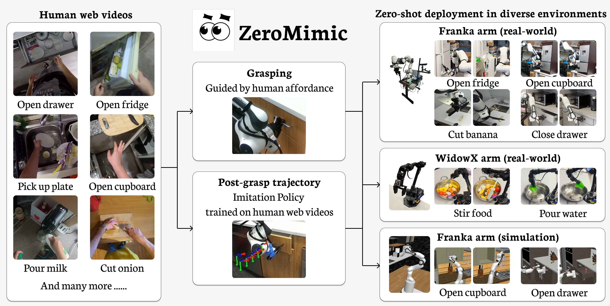
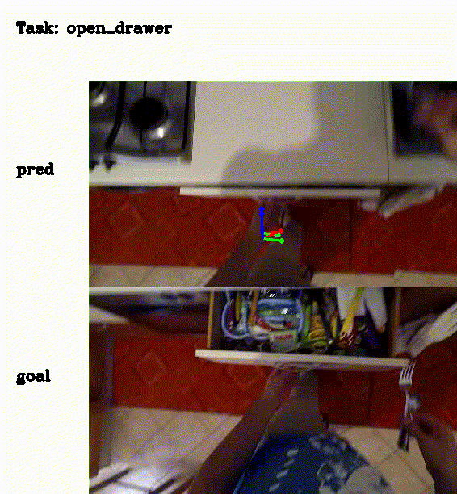

# ZeroMimic: Distilling Robotic Manipulation Skills from Web Videos

## Introduction

### [Project Page](https://zeromimic.github.io/) | [Paper](#) | [Video](https://www.youtube.com/watch?v=nFhNSsR7TEY)

**Authors**: [Junyao Shi\*](https://junyaoshi.github.io/), [Zhuolun Zhao\*](https://zhaolebor.github.io/), [Tianyou Wang](https://viccccciv.github.io/Tianyouwang.github.io/), [Ian Pedroza†](https://ianpedroza.github.io/), [Amy Luo†](https://www.linkedin.com/in/amy-luo-187962199/), [Jie Wang](https://everloom-129.github.io/), [Jason Ma](https://jasonma2016.github.io/), [Dinesh Jayaraman](https://www.seas.upenn.edu/~dineshj/)


**University of Pennsylvania**

**ICRA 2025**

Corresponding to: Junyao Shi (junys@seas.upenn.edu)



This is the offcial demo code of human wrist action prediction in ZeroMimic. ZeroMimic is a system that distills robotic manipulation skills from egocentric human web videos for diverse zero-shot deployment.

## Environment Setup

1. Create a Conda environment using the `environment.yaml` file:

   ```bash
   conda env create -f environment.yaml
   ```

2. Activate the newly created environment:

   ```bash
   conda activate zeromimic
   ```

## Download Checkpoints

TODO


## Run Inference

With the Conda environment activated, run the following command to execute inference:

Replace `"/path/to/your/checkpoint/folder"` with the actual path to your checkpoint folder.
For testing examples under the `example_data` folder, modify the task and example_id  in the `example.py` file in line 10 and 11.
The script will generate a video to visualize the action prediction of human hand wrist.

```bash
python example.py debug_eval_path="/path/to/your/checkpoint/folder"
```

